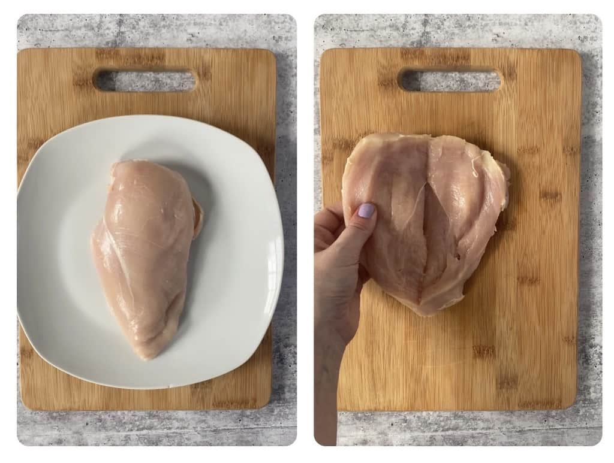

# 🍗 Запечена куряча грудка

### Інгредієнти

* :poultry\_leg: куряча гручка - 1 кг (4 половинки)
* :onion: цибуля - 200 г (1 велика)
* 🧴 майонез - 50г
* :salt: сіль - 10г
* ⚫ чорний перець - 2г

### Посуд та прилади

* 🥣 велика глибока миска або каструля для маринування
* 🔲 жаровня для запікання
* 🔥 пічка
* 📟 термометр для їжі

### Крок за кроком

1. Розрізати курячу грудку :poultry\_leg: сердечком :heart: (англ. butterfly :butterfly:)\
   
2. Гарно засолити з обох сторін і скласти до миски 🥣
3. Поставити в холодильник ❄️ на 1-2 години


Таким чином курка буде рівномірна просолена навіть всередині, оскільки сіль проникає всередину завдяки фізичному процесу, який називається - осмос


4. Нарізати цибулю :onion: кільцями
5. Злити воду з миски 🥣 з куркою :poultry\_leg:
6. Додати майонез 🧴 перець :hot\_pepper: та цибулю :onion: до курки :poultry\_leg:
7. Поставити в холодильник ❄️ на 1-2 години


Таким чином курка буде ніжніша, оскільки цибуля створює агресивну середу, в яку входять кислоти та ензими, які допомагають розбивати протеїни&#x20;


.png>)

8. Розігріти піч 🔥 до 200 °C :thermometer: (400 °F)
9. Покласти пергамент :scroll: на жаровню 🔲 і покласти курку :poultry\_leg: з цибулею :onion:
10. Встромити термометр 📟 для їжі в середину курки :poultry\_leg: і поставити будильник на 68 °C  (155 °F)


Важливо, щоб термометер 📟 був прямо в глибині, щоб чітко виміряти темературу


11. Включити тільки верхній нагрів в пічці 🔥
12. Покласти жаровню 🔲 якомога ближче до нагрівального елементу печі 🔥
13. Як задзвенить термометер 📟 для їжі або приблизно 30 хвилин або як тільки курка :poultry\_leg: почне випускати сік, вимкнути піч, привідкрити дверцяти і залишити курку :poultry\_leg: відпочивати в печі 🔥 на 10-20 хв.&#x20;


:compass: Орієнтир: Якщо курка :poultry\_leg: почне випускати сік, отже температура всередині досягла потрібної



:exclamation:Важливо залишити курку :poultry\_leg: відпочивати в печі 🔥 Це надасть їй ще більше соковитості і вона завершить готування всередині.


### Смачного!

<figure><figcaption>
Смачного! 
</figcaption></figure>

***

Додано: 2023.10.03&#x20;

Теги: #м'ясо #курка
